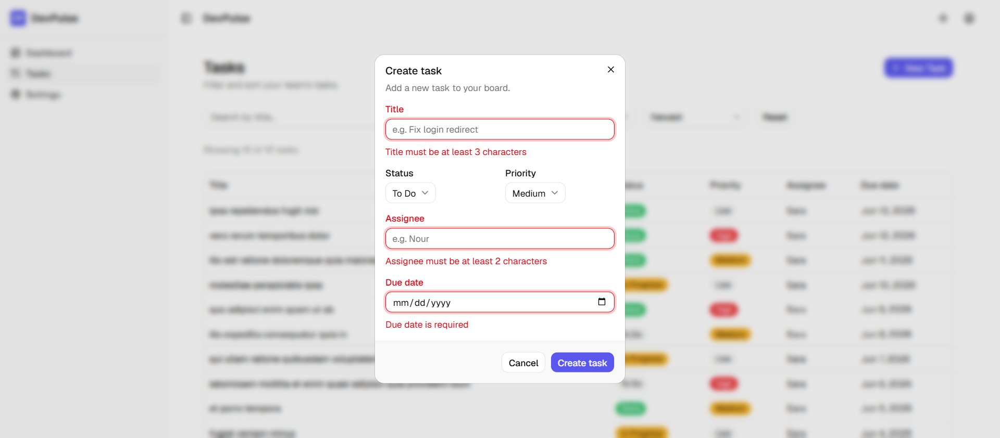
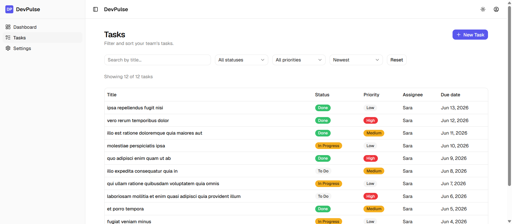
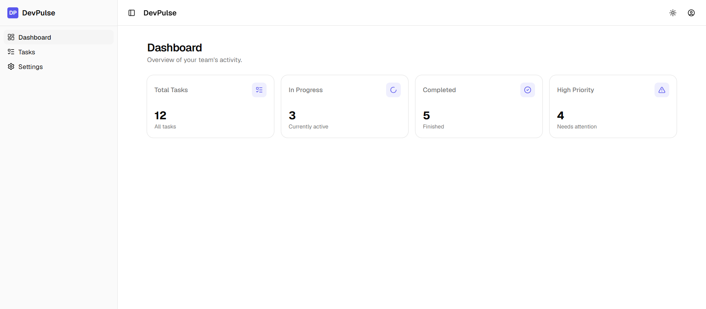
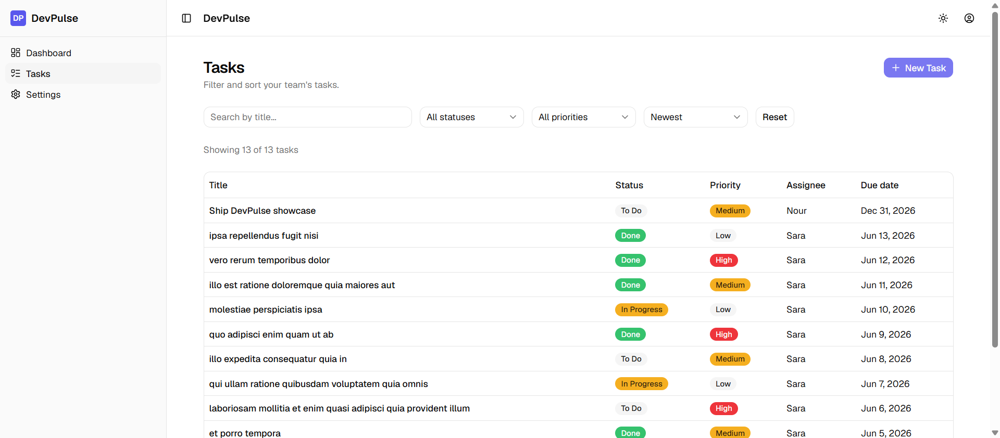
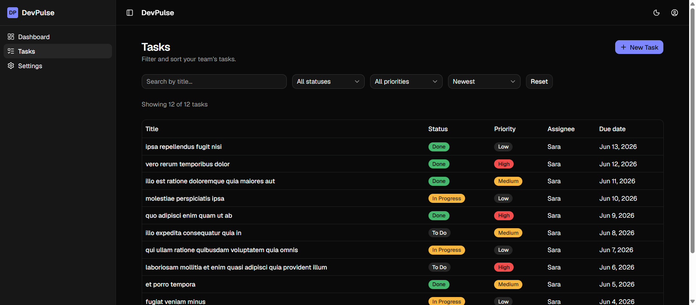

# DevPulse — Technical Demonstration Walkthrough

A short, presenter-ready tour of the core data-layer implementations, form-validation states, and
optimistic UI updates. Each scene is **Action → Expected Result → What it proves**, with a
screenshot of the moment.

> **Setup:** run `npm run dev` and open the printed URL. This app uses a mock API
> (JSONPlaceholder) that does not persist writes — created tasks live in the in-memory cache for the
> session, which is exactly what makes the optimistic-update demo (Scene 4) work.

---

## 0. Dashboard at a Glance

**Scenario: landing on the dashboard.**

- **Action:** Open the app — it lands on the **Dashboard**.
- **What's there:** four accented stat cards (Total / In Progress / Completed / High Priority), a
  **task-status donut** (To Do / In Progress / Done with counts), a **Recent Activity** feed (newest
  tasks with relative timestamps), and a **Quick Actions** grid.
- **What it proves:** Every widget is derived from a **single** cached `["tasks"]` query — no extra
  network requests — and every color is a theme token, so the whole dashboard flips cleanly between
  light and dark mode.


---

## 1. Client-Side Schema Validation (Zod + React Hook Form)

**Scenario: submitting an empty form.**

- **Action:** Open the **New Task** dialog and click **Create task** without filling anything in.
- **Expected result:** The dialog stays open and clean red inline errors appear instantly beneath
  the inputs — "Title must be at least 3 characters", "Assignee must be at least 2 characters",
  "Due date is required".
- **What it proves:** A single Zod schema enforces character lengths, enum types, and a "today or
  later" deadline rule — at runtime *and* as the form's static TypeScript type. No hand-written
  validation code.



---

## 2. Server Data Mapping (Anti-Corruption Layer)

**Scenario: initial data load.**

- **Action:** Go to the **Tasks** page. Open DevTools → **Network** and find the request to
  `/todos`.
- **Technical check:** The mock API returns flat rows:

  ```json
  { "userId": 1, "id": 1, "title": "delectus aut autem", "completed": false }
  ```

- **Verification:** The table renders far richer rows — a **Status** badge, a **Priority** badge,
  an **Assignee**, and a formatted **Due date** — none of which exist in the raw payload.
- **What it proves:** A mapping layer (`api/tasks.ts`) translates the API's vocabulary into the
  app's `Task` model, deriving the extra fields. The UI never touches the raw API shape.



---

## 3. React Query Caching (the code-saving headline)

**Scenario: navigating between pages that share data.**

- **Action:** With DevTools → **Network** open and filtered to Fetch/XHR, navigate
  **Dashboard → Tasks → Dashboard**.
- **Expected result:** Only **one** `GET /todos` request fires for the whole round-trip. The
  Dashboard's stat cards and the Tasks table both render from the same cached data.
- **What it proves:** Dashboard and Tasks share one `["tasks"]` query. TanStack Query dedupes and
  caches it (with a 1-minute stale time), so there is **no manual `useEffect` / loading flag /
  error flag / refetch plumbing** — one `useQuery` hook replaces dozens of lines of bookkeeping,
  and pages stay in sync automatically.

*(Verified live: the `/todos` request count stays at 1 across all three page views.)*



---

## 4. Optimistic Update & Rollback

**Scenario: simulating a network outage.**

- **Action:** In DevTools → **Network**, set throttling to **Offline**. Open the task form, fill in
  valid values, and submit.
- **Expected result:**
  1. **Optimistic insert** — the new task **row** snaps to the top of the table immediately.
  2. **Error catch & rollback** — once the create request fails, an error toast fires and the
     optimistic row is removed, restoring the previous list from a cache snapshot.
- **Timing note (be honest in the demo):** offline, the failed request can take **a few seconds** to
  time out before the rollback fires — it is not instant. Set that expectation so the pause doesn't
  look like a bug.
- **What it proves:** The UI feels instant (optimistic `onMutate` cache write) yet stays correct
  under failure (`onError` snapshot restore) — the standard TanStack Query mutation pattern.



---

## Bonus polish

- **Light / Dark / System theme** — toggle in the top bar; all colors are theme tokens, so badges
  and surfaces stay legible in both modes (see the table in dark mode below).
- **Filtering & sorting** — search by title, filter by status/priority, sort by date/priority;
  all client-side and memoized.


